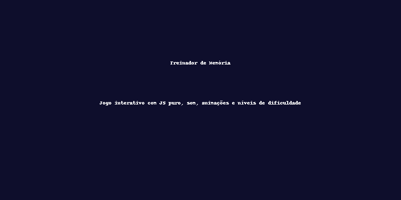

# 🧠 Treinador de Memória

Um jogo interativo desenvolvido em HTML, CSS e JavaScript puro que estimula a memória do jogador através de sequência de cores, sons e níveis de dificuldade. Ideal para praticar lógica, concentração e habilidades cognitivas — e também para aprender programação de forma divertida.

## 🚀 Funcionalidades

- ✅ Sequência de cores aleatória
- ✅ Sistema de pontuação e recorde salvo no navegador
- ✅ Três níveis de dificuldade (Fácil, Médio e Difícil)
- ✅ Feedback sonoro e visual para acertos e erros
- ✅ Efeitos visuais com animação ao piscar
- ✅ Design responsivo e otimizado para navegadores modernos

## 🎮 Como Jogar

1. Escolha a dificuldade (Fácil, Médio ou Difícil)
2. Clique em **Iniciar**
3. Memorize a sequência de cores que piscará
4. Repita a sequência clicando nas cores
5. A cada rodada correta, a sequência aumenta
6. Errou? Tente bater o seu recorde na próxima!

7. ## 📌 Demonstração
👉 [Jogar Agora] (https://williamcssjc.github.io/treinador-de-memoria/)

## 🧩 Tecnologias Utilizadas

- HTML5
- CSS3 (com animações e responsividade)
- JavaScript (lógica de jogo, DOM, localStorage, sons)

## 📁 Estrutura de Arquivos

📦 treinador-memoria
├── index.html
├── style.css
├── script.js
├── sons/
│ ├── som_vermelho.mp3
│ ├── som_azul.mp3
│ ├── som_verde.mp3
│ ├── som_amarelo.mp3
│ ├── som_erro.mp3
│ ├── som_iniciar.mp3
│ └── som_recorde.mp3
└── treinador_memoria_banner.png

## 🧠 Autor

Desenvolvido com 💻 e ☕ por [William Costa Santos](https://github.com/williamcssjc?tab=repositories)
Este projeto faz parte de um ciclo de evolução pessoal e profissional com foco em boas práticas, modularidade e visão de produto.

## 📌 Versão

**v1.0 – Projeto completo e funcional.**  
Planejada a refatoração futura com componentes, testes e arquitetura modular para versão 2.0.

